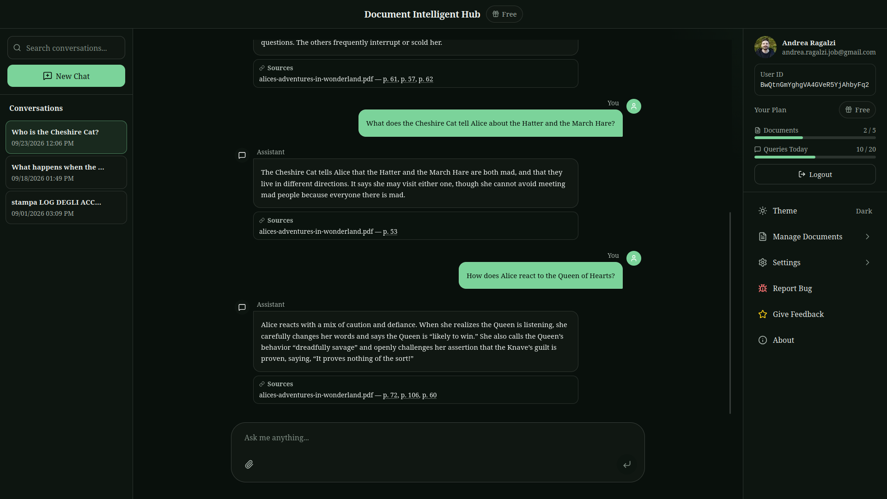

# Document Intelligent Hub

Document Intelligent Hub is a personal, independently built full-stack project focused on Python backend engineering and applied RAG. It allows users to search private PDF collections and ask questions grounded in their own documents. Its core is a Python 3.12 and FastAPI REST API that authenticates users with Firebase, indexes document content in ChromaDB with local HuggingFace embeddings, and returns source-grounded answers with filename and page citations.

The project is full-stack but intentionally backend-heavy. It demonstrates authenticated API design, third-party integrations, document-processing workflows, application-level user isolation, maintainable service boundaries, and automated testing around an applied Retrieval-Augmented Generation (RAG) system.

[](https://www.python.org/)
[](https://fastapi.tiangolo.com/)
[](https://nextjs.org/)
[](https://www.typescriptlang.org/)

**[Try the Live Demo](https://document-intelligent-hub.vercel.app)**

**Try without registration.** Click **Try Demo** to enter a shared read-only workspace with five synthetic InGen documents. Ask questions and inspect filename/page citations; guest conversations are not saved and guests cannot upload or delete documents.

**Create an account.** Upload and manage your own PDFs, then ask questions over documents scoped to your verified Firebase identity. Registered conversations can be persisted in Firestore.



## What It Does

- Verified users can batch-upload, manage, and search private PDF collections, choosing how to resolve owned filename collisions.
- Anyone can use **Try Demo** without registration. Firebase Anonymous Authentication opens a read-only workspace backed by five shared synthetic InGen enterprise documents.
- Natural-language questions are answered from retrieved document context, with source filenames and available page citations returned for grounding.
- File-aware and multilingual queries support conversations over indexed documents.
- Registered users' saved conversations are persisted in Firestore through the client application; guest sessions do not persist conversations.

## Backend Engineering Highlights

- **REST API design:** FastAPI routers and Pydantic schemas define authentication, document, query, usage, and support contracts, with OpenAPI documentation available at runtime.
- **Authentication boundary:** Firebase Admin verifies bearer tokens; protected routes derive the user ID from the verified token rather than trusting a client-selected owner.
- **Bounded guest demo:** anonymous identities can only list/read the shared demo corpus and query the production RAG pipeline; server-side UID, IP, concurrency, and global daily controls bound public demo usage.
- **Backend integrations:** the service coordinates Firebase, Firestore, OpenAI, ChromaDB, local HuggingFace embeddings, and Resend-backed support workflows.
- **Pragmatic ports and adapters:** routers handle HTTP, application services coordinate workflows, application-owned ports describe required capabilities, and infrastructure adapters isolate Firestore, OpenAI, filesystem, Resend, and Chroma integrations.
- **Multi-user isolation:** indexed chunks carry the verified Firebase user ID in metadata, and repository operations apply that metadata filter when listing, retrieving, and deleting documents.
- **Document processing:** PDF parsing, document classification, adaptive chunking, language detection, metadata enrichment, batch indexing, and cleanup are isolated in dedicated services.
- **Applied RAG:** query parsing, conditional reformulation, expansion, filtered retrieval, hybrid reranking, evidence selection, answer generation, and citation extraction form an explicit pipeline.
- **Automated tests:** pytest covers backend services, repositories, authentication helpers, and API behavior; Vitest and React Testing Library cover frontend hooks, stores, and components.

## Key Capabilities

- Structural or fixed-size chunking selected from document characteristics
- Persistent vector storage with optional filename filters
- Hybrid semantic, lexical, and document-title reranking with distinct-evidence selection
- Automatic language detection and translated retrieval; answer generation selects language from the current request and bounded history
- Responsive Next.js client for document management and chat

## Architecture

```text
┌─────────────────────────────────────────────────────────────┐
│ Next.js 16 + TypeScript                                     │
│                                                             │
│ • Firebase Authentication                                   │
│ • Firestore conversation persistence                        │
│ • Document management, chat, and citation UI                │
└───────────────────────┬─────────────────────────────────────┘
                        │ REST API + Firebase bearer token
                        ▼
┌─────────────────────────────────────────────────────────────┐
│ FastAPI + Pydantic                                          │
│                                                             │
│ Routers → Application services → Ports                     │
│    │                 ↑                                      │
│    │                 └─ Infrastructure adapters             │
│    │                                      │                 │
│    └─ Firebase identity                   └─ External SDKs  │
└─────────────────────────────────────────────────────────────┘
```

FastAPI routers validate requests and delegate to application services, which depend on application-owned ports and concrete adapters. Firebase supplies identity, ChromaDB persists document chunks and embeddings, and adapters isolate Firestore, OpenAI, local HuggingFace embeddings, file storage, and email delivery. See the [backend handbook](backend/README.md) for the implementation boundaries.

## RAG Pipeline

### Document Indexing

```text
Authenticated PDF upload
→ validation, parsing, classification, chunking, and language metadata
→ local HuggingFace embeddings
→ ChromaDB indexing
```

### Query and Answer Generation

```text
Verified-email Firebase context or restricted anonymous demo context
→ parsing and file filtering
→ optional contextual reformulation
→ workspace-scoped retrieval and reranking/evidence selection
→ grounded OpenAI answer
→ trusted filename/page citations
```

Registered requests remain scoped to their verified Firebase UID. Anonymous requests use one shared read-only synthetic InGen namespace. The API returns complete JSON with compatibility `source_documents` and structured filename/page `citations`.

## Tech Stack

| Area                 | Technologies                                                                                            |
| -------------------- | ------------------------------------------------------------------------------------------------------- |
| Backend              | Python 3.12, FastAPI, Uvicorn, Pydantic Settings                                                        |
| RAG and integrations | LangChain, OpenAI, ChromaDB, HuggingFace Sentence Transformers, Unstructured, Firebase Admin, Firestore |
| Frontend             | Next.js 16, React 19, TypeScript, Firebase, TanStack Query, Zustand, Tailwind CSS                       |
| Testing              | pytest, pytest-asyncio, pytest-cov, Vitest, React Testing Library                                       |
| Quality and tooling  | Poetry, mypy, Pylint, ESLint, Prettier, pre-commit, Docker Compose                                      |

## Testing

GitHub Actions validates backend and frontend changes through static analysis, automated tests, frontend production build checks, secret scanning, and relevant Docker and Firebase integration checks.

Backend:

```bash
cd backend
poetry run pytest

# Optional coverage report
poetry run pytest --cov=app --cov-report=term
```

Frontend:

```bash
cd frontend
npm run test:run

# Optional coverage report
npm run test:coverage
```

## Run Locally

Prerequisites: Python 3.12, Poetry, Node.js with npm, an OpenAI API key, and a dedicated DEV Firebase project with Web and Admin SDK configuration. Do not use the production Firebase project for localhost.

1. Prepare the ignored local configuration files:

   ```bash
   cp backend/.env.example backend/.env.local
   cp frontend/.env.example frontend/.env.local
   ```

   Add the local Firebase service-account file at `backend/app/config/firebase-service-account.dev.json`.

2. Install and start the backend:

   ```bash
   cd backend
   poetry install
   poetry run uvicorn main:app --reload --host 127.0.0.1 --port 8000
   ```

3. In another terminal, install and start the frontend:

   ```bash
   cd frontend
   npm ci
   npm run dev
   ```

4. Open:

   - Frontend: http://127.0.0.1:3000
   - FastAPI documentation: http://127.0.0.1:8000/docs

See the [backend handbook](backend/README.md), [frontend handbook](frontend/README.md), and [environment guide](ENVIRONMENTS.md) for component and Firebase setup details.

## Current Status & Limitations

- Full RAG usage requires external Firebase and OpenAI configuration.
- The FastAPI backend returns a complete JSON answer. The frontend then emits that completed text character by character, so this is not end-to-end model streaming.
- Dockerfiles and a Compose configuration are present, but the complete clean-clone deployment workflow has not yet been verified.
- Citations can identify a page only when the selected chunk carries valid PDF page metadata; otherwise the source remains filename-level.

## Component Documentation

- [Backend handbook](backend/README.md)
- [Frontend handbook](frontend/README.md)

## Author

**Andrea Ragalzi**

- GitHub: [@andrea-ragalzi](https://github.com/andrea-ragalzi)
- Email: andrea.ragalzi.code@gmail.com

## License

This project is licensed under the [MIT License](LICENSE).
